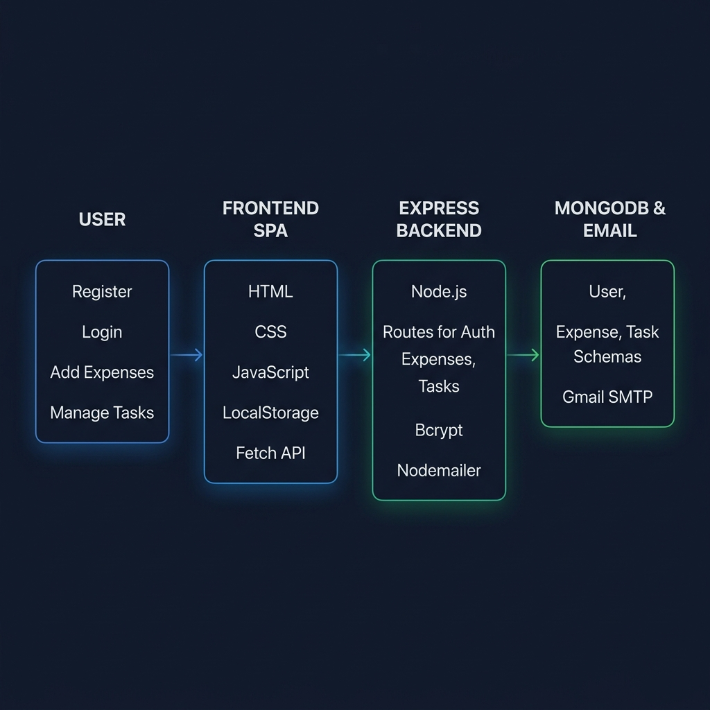

# Smart Tracker

A full-stack web app to track daily expenses and tasks. It supports user registration, login, expense tracking with categories, task management, and password resets via email. Everything is saved in MongoDB.

## Features

- User signup, login, and email password resets (6-digit code via Nodemailer)
- Track expenses with categories (Food, Transport, Utilities, Entertainment, Other)
- Task checklist (add, mark completed, delete)
- Dashboard overview with stats and Chart.js category breakdown
- Data isolated per user account

## Tech Stack

- **Frontend:** HTML, CSS, JavaScript (Vanilla), Chart.js
- **Backend:** Node.js, Express 5, bcryptjs, Nodemailer
- **Database:** MongoDB (Mongoose)

## Application Workflow



> Overview of the Smart Tracker architecture connecting the frontend, Express backend, Nodemailer email service, and MongoDB database.

## Project Structure

```text
smart-tracker/
├── backend/
│   ├── models/ (User.js, Expense.js, Task.js)
│   ├── routes/ (auth.js, expenses.js, tasks.js)
│   ├── utils/  (mailer.js)
│   └── server.js
├── docs/
│   └── smart-tracker-workflow.png
├── frontend/
│   ├── css/    (style.css)
│   ├── js/     (auth.js, dashboard.js)
│   ├── app.js
│   ├── index.html
│   └── dashboard.html
├── .env
└── package.json
```

## Setup & Running

1. **Install dependencies:**
   ```bash
   npm install
   ```

2. **Configure environment (`.env`):**
   ```env
   MONGO_URI=mongodb://127.0.0.1:27017/smart-tracker
   PORT=5000
   EMAIL_USER=your_email@gmail.com
   EMAIL_PASS=your_gmail_app_password
   ```

3. **Start the server:**
   ```bash
   npm run dev
   ```
   Open `http://localhost:5000` in your browser.

## Available Scripts

- `npm start` — Run server with Node
- `npm run dev` — Run server with Nodemon (auto-reload)

## API Endpoints

| Method | Endpoint | Description |
| --- | --- | --- |
| POST | `/api/auth/register` | Register new user |
| POST | `/api/auth/login` | User login |
| POST | `/api/auth/forgot-password` | Send 6-digit reset code to email |
| POST | `/api/auth/reset-password` | Reset password using code |
| GET / POST / DELETE | `/api/expenses` | Manage expenses |
| GET / POST / PUT / DELETE | `/api/tasks` | Manage tasks |

## Future Improvements

- JWT authentication instead of `user-id` header
- Edit functionality for expenses & tasks
- Date range filtering & budget alerts
- Export expenses to CSV

## Troubleshooting

- **MongoDB Error:** Check if MongoDB is running locally on port 27017.
- **Email Reset Error:** Make sure `EMAIL_USER` and a Gmail App Password (`EMAIL_PASS`) are set in `.env`.
